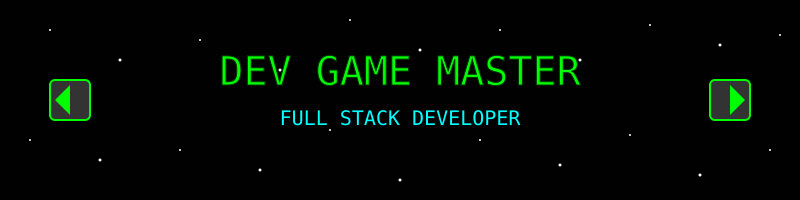

# 🎮 ¡PLAYER 1 READY! -Jonatan Albenio Medina Sandoval 🎮

<div align="center">
  

  
  
  <br/>
  
</div>

## 🏆 Stats de Jugador

<div align="center">
  
</div>

## 📊 Mis Puntuaciones

<div align="center">
  <table>
    <tr>
      <td>
        
      </td>
      <td>
        
      </td>
    </tr>
  </table>
</div>

<div align="center">
  
</div>

## 🎮 Nivel de Experiencia

```
Angular       ■■■■■■■■■■  100/100
React         ■■■■■■■■□□   80/100
TypeScript    ■■■■■■■■■□   90/100
Spring Boot   ■■■■■■■■■□   90/100
.NET          ■■■■■■■□□□   70/100
Django        ■■■■■■□□□□   60/100
```

## 🧙‍♂️ Clases y Habilidades

<div align="center">
  
### 🏹 Frontend (Arquero)
  


### ⚔️ Backend (Guerrero)
  


### 🧙‍♂️ Herramientas (Mago)
  


</div>

## 🗺️ Mapa de Actividad

<div align="center">
  <picture>
    <source media="(prefers-color-scheme: dark)" srcset="https://raw.githubusercontent.com/jonatanmedina12/jonatanmedina12/output/github-snake-dark.svg">
    <source media="(prefers-color-scheme: light)" srcset="https://raw.githubusercontent.com/jonatanmedina12/jonatanmedina12/output/github-snake.svg">
    
  </picture>
</div>

## 🌟 Misiones Completadas

<div align="center">

| Proyecto | Descripción | Tecnologías | 
|----------|-------------|-------------|
| 🧩 Proyecto 1 | Una aplicación increíble | Angular, Spring Boot |
| 🔮 Proyecto 2 | Un servicio revolucionario | React, Django |
| 🎲 Proyecto 3 | Una plataforma innovadora | TypeScript, .NET |

</div>

## 💬 Diálogos NPC

<div align="center">
  
  
</div>

## 🌐 Conectar en Multijugador

<div align="center">
  <a href="https://linkedin.com/in/tu-linkedin" target="_blank">
    
  </a>
  <a href="https://twitter.com/tu-twitter" target="_blank">
    
  </a>
  <a href="mailto:tuemail@gmail.com" target="_blank">
    
  </a>
</div>

<div align="center">
  
</div>

---

<div align="center">
  
  
  ### PRESS START TO COLLABORATE
</div>