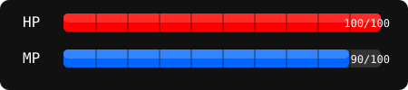

# 🎮 ¡PLAYER 1 READY! - Jonatan Medina 🎮

  
  
   
  

## 🏆 Stats de Jugador

  

## 📊 Mis Puntuaciones

  <table>
    <tr>
      <td>
        
      </td>
      <td>
        
      </td>
    </tr>
  </table>

  

## 🎯 Tech Skills Tree (Árbol de Habilidades)

  <table border="0" style="border-collapse: collapse; width: 100%;">
    <tr>
      <td align="center" width="33%">
         
        
        
        
        
        
      </td>
      <td align="center" width="33%">
         
        
        
        
        
        
        
      </td>
      <td align="center" width="33%">
         
        
        
        
        
      </td>
    </tr>
  </table>

## 🎮 Ultimate Skills & Power-Ups

  <table border="0">
    <tr>
      <td>
        
      </td>
      <td>
        
      </td>
      <td>
        
      </td>
    </tr>
    <tr>
      <td>
        
      </td>
      <td>
        
      </td>
      <td>
        
      </td>
    </tr>
  </table>

## 🗺️ Mapa de Actividad

  <picture>
    <source media="(prefers-color-scheme: dark)" srcset="https://raw.githubusercontent.com/jonatanmedina12/jonatanmedina12/output/github-snake-dark.svg">
    <source media="(prefers-color-scheme: light)" srcset="https://raw.githubusercontent.com/jonatanmedina12/jonatanmedina12/output/github-snake.svg">
    
  </picture>

## 🌟 Misiones Completadas (Proyectos Legendarios)

  

    
    <h3>🧩 Dungeon Master</h3>
    
Sistema de gestión avanzado con arquitectura modular

    
<b>Armas:</b> Angular, Spring Boot, PostgreSQL

    
  

  
  

    
    <h3>🔮 Realm Connector</h3>
    
API Gateway para integración de servicios en la nube

    
<b>Armas:</b> React, Node.js, AWS

    
  

  
  

    
    <h3>🎲 Data Wizard</h3>
    
Dashboard de análisis con visualizaciones en tiempo real

    
<b>Armas:</b> TypeScript, .NET, SQL Server

    
  

## 💬 Diálogos NPC

  
  

## 🌐 Conectar en Multijugador

  
  
  

  

---
## 💪 Estadísticas vitales

  

  
  
  ### PRESS START TO COLLABORATE

